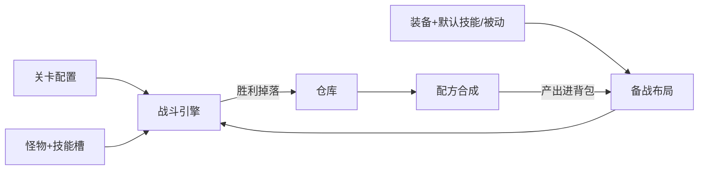

# Game3 核心玩法与核心自定义说明

> 面向策划 / 后台配置 / 后续内容扩展。  
> 本文描述**当前代码已实现**的关卡、怪物、技能、装备、玩法闭环与战斗引擎，并标明每一层「可自定义」的配置点。  
> 代码根路径：`src/main/java/org/wx/core/wxBusiness/game/`

---

## 0. 一句话总览

玩家在**备战**中整理仓库 / 背包、穿戴装备、布置阵型，在**出击**中选择关卡开战。  
战斗是**行动值驱动**的自动演算：单位积攒「行动进度」出手，用**普攻 / 小技能 / 大招**造成伤害或治疗，通过**充能条件**与**被动**形成 build。  
胜利后按**怪物掉落表**独立掷骰，物品进仓库；可用**配方**把材料合成为装备，再带回战场。



---

## 1. 关卡（Stage）

### 1.1 层级结构

| 层级 | 表 | ID 前缀 | 关键字段 |
|------|-----|---------|----------|
| 分类 / 大关 / 小关 | `app_stage`（单表树） | STY / SCP / SLV | `parent_id` + `kind`（`TYPE`/`CHAPTER`/`LEVEL`）+ `name`/`code`/`sort`/`enable` |
| 摆怪 | `app_stage_level_monster` | SLM | `levelId` + `monsterId` + `posCol` + `posRow` + `sort` |

用户 API：`/api/stage`（`A5StageController`）  
后台：关卡树管理（`B10StageController`）

### 1.2 棋盘与摆怪

- 战场固定 **横 6 × 竖 5**（`BattleGrid.COLS=6, ROWS=5`）。
- 摆怪坐标为**左上角锚点** `(posCol, posRow)`，占地取怪物的 `gridW × gridH`。
- 同关内占地不可重叠、不可越界（`StageLevelMonsterService` / `BattleGrid`）。

### 1.3 可自定义点（关卡）

| 自定义项 | 说明 |
|----------|------|
| 分类 / 章节 / 小关树 | 任意拆分主线、活动等；`code`/`sort` 控制展示与顺序 |
| 每关怪物组合 | 换 `monsterId`、数量、站位即可改难度与节奏 |
| 启用开关 | `enable` 控制是否对玩家可见 |
| 推荐节奏（内容向） | 前几关杂兵 → 中段稀有 → 关底 BOSS（配置习惯，非硬编码） |

---

## 2. 怪物（Monster）

### 2.1 基础配置

表：`app_monster`（前缀 `MST`）

| 字段 | 含义 |
|------|------|
| `name` / `rarity` / `sort` / `remark` | 展示与稀有度 |
| `gridH` / `gridW` | 占地（高×宽）；多数稀有度**强制固定** |
| `baseAtk` / `baseHp` / `baseDef` / `baseAction` | 战斗四维；`baseAction` 为行动阈值（越小出手越快） |
| `normalSkillId` / `smallSkillId` / `ultimateSkillId` | 普攻 / 小技能 / 大招 → `app_active_skill` |

### 2.2 稀有度与占地（强制）

枚举：`MonsterRarity`

| 稀有度 | 占地（高×宽） | 说明 |
|--------|----------------|------|
| NORMAL | 1×1 | 杂兵 |
| RARE | 1×2 | 精英横向 |
| EPIC | 2×2 | 史诗 |
| BOSS | 2×4 | 章末级 |
| SPECIAL | 默认可改 | 不强制；上限不超过 5×6 |

`Monster.applyRaritySize()` 在保存时按稀有度纠正占地。

### 2.3 技能槽行为

- 开战时 `BattleService.bindMonsterSkills`：按三个槽位挂技能。
- **普攻槽为空** → 回退全局默认普攻（`code = DEFAULT_NORMAL`）。
- 小技能 / 大招可空；有则进入单位技能列表，参与充能与施放。

### 2.4 掉落（挂在怪物上，不挂在关卡上）

表：`app_monster_drop`（`MDP`）

| 字段 | 含义 |
|------|------|
| `monsterId` / `itemId` | 哪只怪掉什么物 |
| `dropRate` | **百分比整数**：`100` = 100%；各行**独立掷骰** |
| `minQty` / `maxQty` | 命中后数量；相等则固定，否则偏小非线性分布 |
| `enable` / `sort` | 开关与排序 |

胜利结算：`MonsterDropService.rollAndGrantToWarehouse` → 合并同物品 → 进**仓库**。

### 2.5 可自定义点（怪物）

| 自定义项 | 说明 |
|----------|------|
| 外形定位 | 名称 + 稀有度 + 占地决定战场占格与 UI 气质 |
| 数值曲线 | 四维直接配；与关卡摆怪组合形成难度 |
| 技能身份 | 三槽指向任意主动技能，形成「只会普攻 / 会放小技能 / BOSS 有大招」 |
| 掉落经济 | 材料高概率、装备低概率；同一怪可配多行独立掉落 |
| 复用 | 同一怪物模板可出现在多关（摆怪表引用） |

---

## 3. 技能（核心）

技能是战斗与装备成长的**最大自定义面**：主动技能定义「怎么打」，充能定义「何时能放」，效果定义「打谁、打多少」，被动定义「穿戴与战场规则」。

### 3.1 主动技能 ActiveSkill

表：`app_active_skill`（`ASK`）

| 字段 | 含义 |
|------|------|
| `name` / `code` / `skillType` | 名称；`NORMAL` / `SMALL` / `ULTIMATE` |
| `needChargeMode` | `SELF_BASE_ACTION`：所需充能 = 施法者基础行动值；`MANUAL`：用 `needCharge` |
| `needCharge` | MANUAL 时的充能需求 |
| `maxCastSkill` 等 | 释放次数上限（引擎侧重 `maxCastSkill`；0 = 不限） |
| `formulaJson` | 技能级公式（展示/扩展）；**实际结算以效果上的公式为准** |

**全局默认普攻**：`code = DEFAULT_NORMAL`，角色创建与怪物空普攻槽都会用到。

### 3.2 充能条件 SkillCharge

表：`app_skill_charge`（`SCH`），挂在某个 `skillId` 上，可多条。

| conditionType | 行为 |
|---------------|------|
| `ACTION_VALUE` | 全局每经过 `everyActionValue` 点行动值，`chargeGain` 点充能；`scope` 目前为 `GLOBAL` |
| `SKILL_CHARGE` | 当有人 `CAST` / `RECEIVE` 某技能时充能；匹配：`ANY` / `ANY_TYPE`（配合 `matchSkillType`）/ `SPECIFIC`（`matchSkillId`） |

引擎约定：

- 所有主动技能（普攻 / 小技能 / 大招）都是独立充能技能；
- 普攻固定每经过 1 VA 获得 1 点基础充能，所需充能等于单位当前行动阈值；
- 普攻也可以额外响应其配置的 `SKILL_CHARGE` 事件；
- 任意技能达到所需充能后立即释放，不等待额外行动回合。

### 3.3 技能效果 SkillEffect

表：`app_skill_effect`（`SEF`）

| effectType | 含义 |
|------------|------|
| `DAMAGE` | 伤害；结算约 `max(1, 公式值 - def/10)` |
| `HEAL` | 治疗 |
| `ATTR_MODIFY` | 改属性：`attrKey`=`ATK`/`MAX_HP`/`DEF`，`attrDir` 增减 |

**目标 `targetType`（常用）**

| 目标 | 含义 |
|------|------|
| SELF | 自己 |
| FIRST | 首目标（从前排往身后、同行左→右） |
| FRONT_ROW / BACK_ROW | 前排 / 后排 |
| RANDOM_ENEMY | 随机敌方 |
| ENEMY_MAX_HP / ENEMY_MIN_HP | 敌方生命最高 / 最低 |
| ALLY_MIN_HP | 己方生命最低 |
| ALL_ENEMY / ALL_ALLY | 全体敌 / 己 |

前排后排约定（相对棋盘 row，越大越靠下）：

- **敌方**：前排 = row 最大侧；后排 = row 最小侧  
- **己方**：前排 = row 最小侧；后排 = row 最大侧  

`hitSegments`：分段命中次数。  
`triggerRate`：该效果条目的触发概率，整数 **0–100**，默认 **100**（必触发）。施放时对该条目单独掷骰：`null`/≥100 必触发，≤0 永不触发，否则 `nextInt(100) < rate`；未触发时写战报「未触发（概率 N%）」并跳过目标/段数结算。可用来做「普攻有概率附加第二段效果」等。  
`formulaJson`：token 数组，例：

```json
[
  {"kind":"PARAM","paramMode":"READ","readRole":"SELF","readCategory":"ATTR","readKey":"ATK"},
  {"kind":"OP","op":"*"},
  {"kind":"PARAM","paramMode":"LITERAL","value":"1.5"}
]
```

可读键示例：`ATK` / `HP` / `MAX_HP` / `DEF` / `ACTION` / `ELAPSED_ACTION` 等（见 `FormulaEvalUnit` / `FormulaReadKey`）。

### 3.4 被动技能 PassiveSkill

表：`app_passive_skill`（`PSK`）+ 条件 / 效果子表。

| passiveType | 何时生效 | 效果载体 |
|-------------|----------|----------|
| `OUT_BASIC` | 备战汇总装备加成（进战斗前） | `app_passive_effect`：ATK/MAX_HP/DEF 等 |
| `OUT_ADVANCED` | 同上 | 吸血、攻速、增伤/减伤、最终属性比例等 |
| `IN_ANCHOR` | 战斗中锚点时机 | `app_passive_combat_effect`（含 `triggerRate` / `durationAv`） |
| `IN_PERIODIC` | 战斗中状态总线扫描（上升沿/阶梯，一次性结算） | 同上；可限 `maxTriggerPerBattle` |
| `IN_SUSTAINED` | 战斗中实时判定：条件成立套用，不成立撤销 | 仅 `ATTR_MODIFY`；由条件维持，不用 `durationAv` |

**三类战斗内语义对照**

| 类型 | 触发 | 属性增益 |
|------|------|----------|
| 周期 `IN_PERIODIC` | 条件刚变为真（或阶梯进级）时打一次 | 可永久，或 `durationAv` 行动值后撤销；再触发刷新时长不叠层 |
| 锚点 `IN_ANCHOR` | 放技能/受伤等锚点 | 同上 |
| 持续 `IN_SUSTAINED` | 每轮实时：真→挂 buff，假→撤 buff | 条件窗口内维持；不按时间轴到期 |

`ATTR_MODIFY` 属性键含基础（ATK/MAX_HP/DEF）与高级（吸血/攻速/造成·受到伤害比例/最终攻防血）；公式算增益量。高级键接入战斗伤害/吸血/攻速重算。

**锚点类型 `PassiveAnchorType`（节选）**

- `AFTER_CAST_CHARGE`：释放充能技能后  
- `AFTER_RECEIVE_CHARGE`：受到充能技能后  
- `AFTER_TAKE_CHARGE_DMG` / `AFTER_DEAL_CHARGE_DMG`：受到 / 造成充能技能伤害后  

可配合技能匹配（任意 / 类型 / 指定技能）。

**周期/持续判定 `PeriodicTriggerMode`**：`SELF` / `ANY` / `ANY_ENEMY` / `ANY_ALLY` / `FORMULA`。

**生效条件 `PassiveCondition`（SELECT 模式）**：穿戴某物品、某物品类型、装备某技能、某技能类型、公式比较等。

### 3.5 技能挂到谁身上

| 载体 | 挂法 |
|------|------|
| 怪物 | 三槽 FK → ActiveSkill |
| 玩家角色 | `app_player_role_skill`；创建时保证有默认普攻 |
| 武器 | `app_item_weapon.normalSkillId`：**覆盖**角色全部 NORMAL |
| 装备默认充能技 | `app_item_default_skill`（仅 SMALL/ULTIMATE 进战斗合并） |
| 装备默认被动 | `app_item_default_passive`（按被动类型占槽） |

开战合并顺序（己方，见 `BattleService`）：

1. 角色已学会的主动技能  
2. 若武器绑定了普攻 → 替换所有 NORMAL  
3. 合并已穿戴装备的默认充能技能  
4. 过滤后的锚点 / 周期 / 持续效果被动挂到每个己方单位  

### 3.6 可自定义点（技能 · 重点）

| 层级 | 可自定义 |
|------|----------|
| 技能身份 | 新建普攻 / 小技能 / 大招；改名、编码、次数上限 |
| 充能节奏 | 纯吃行动值、吃普攻次数、吃特定小技能、混合多条充能 |
| 伤害形态 | 单体 / 前排 / 全体 / 随机；倍率与公式；治疗与属性修改 |
| 装备技能 | 武器换普攻手感；装备自带小技能/大招槽位数与默认填充 |
| 被动成长 | 基础面板、高级战斗修正、锚点反击/联动、周期条件触发 |
| 怪物 AI 技能包 | 只配槽位即可改变威胁（无独立 AI 脚本，统一「有充能就放」） |

---

## 4. 装备（Item / Equip）

### 4.1 物品主表

表：`app_item`（`ITM`）

| 字段 | 含义 |
|------|------|
| `code` / `name` / `icon` / `itemType` | 编码、名、图标（`/art/item/xxx.png` 或空） |
| `maxStack` / `weight` / `enable` / `sort` | 堆叠与排序 |
| `chargeSkillSlotCount` | 默认充能技能槽数量 |
| `basic/advanced/anchor/periodic/sustainedPassiveSlotCount` | 各类默认被动槽 |
| `playerDefaultEdit*` / `playerMaxEdit*` | 玩家可编辑槽的默认/上限（扩展用） |

`ItemType`：`MATERIAL` / `WEAPON` / `ARMOR` / `GLOVES` / `HELMET` / `LEGS` / `ACCESSORY`

### 4.2 类型扩展表（数值）

| 类型 | 表 | 主要字段 |
|------|-----|----------|
| 材料 | `app_item_material` | `grade` |
| 武器 | `app_item_weapon` | `baseAtk`，攻速 ±，`normalSkillId` |
| 护甲/手套/头盔/腿 | `app_item_armor` 等 | `hp` / `defense`，攻速 ± |
| 饰品 | `app_item_accessory` | 攻速 ±（无面板 ATK/HP/DEF） |

### 4.3 穿戴

- 玩家装备栏：`app_player_equip`（武器 / 护甲 / 手套 / 头盔 / 腿 / 饰品×3）。
- 装备来源：战斗背包 `app_battle_bag`；卸下回背包。
- 仓库 `app_warehouse_item` ↔ 背包：备战页转移。

### 4.4 装备加成进战斗

`EquipBonusService.sumBonus(uid)`：

1. 汇总各部位扩展表的面板（武器攻击、防具生命防御等）  
2. 汇总已穿戴装备上、条件满足的 **OUT_*** 被动  
3. 与角色 `base*` / `extra*` / `final*Ratio` 合并  

最终展示与开战属性（概念式）：

```text
最终值 ≈ (基础 + 额外 + 装备面板/OUT加成) × (角色最终比例 + OUT 最终比例加成)
行动值 / 攻速 ← AtkSpeedService（角色 + 装备攻速修正）
```

### 4.5 配方

| 表 | 含义 |
|----|------|
| `app_recipe` | 产出 `outputItemId` × `outputQty` |
| `app_recipe_material` | 消耗材料 `itemId` × `quantity` |

`CraftService.craft`：校验仓库数量 → 扣仓库 → **产出进入战斗背包**（不是直接穿上）。

### 4.6 可自定义点（装备）

| 自定义项 | 说明 |
|----------|------|
| 物品谱系 | 材料 / 各部位装备；`code` 对接美术与查询 |
| 面板数值 | 攻击、生命、防御、攻速修正 |
| 武器手感 | `normalSkillId` 换掉角色普攻 |
| Build 槽 | 充能技能槽数 + 四类被动槽数 + 默认填充 |
| 成长线 | 配方消耗与产出决定合成树；掉落决定获取途径 |
| 图标 | `icon` 填 `/art/item/{code}.png` |

---

## 5. 玩法闭环（玩家流程）

### 5.1 主循环

1. **登录** → 首页  
2. **备战**  
   - 仓库 ↔ 背包转移  
   - 穿戴 / 卸下装备（改面板与技能）  
   - 查看角色属性、技能说明  
3. **布局**  
   - 己方角色放到 6×5；主角必须上场（前端校验）  
4. **出击**  
   - 选分类 → 章 → 小关 → 预览敌方摆怪 → 开战  
5. **战斗**  
   - 服务端演算完整战报 + 事件流；前端回放  
6. **结算**  
   - 胜利：掉落进仓库  
   - 失败 / 平局：无该次掉落（以当前 `BattleService` 胜利发放为准）  
7. **合成**  
   - 仓库材料 → 配方 → 装备进背包 → 回到备战  

### 5.2 关键 API（用户侧）

| 能力 | 控制器（示例） |
|------|----------------|
| 关卡树 / 小关怪 | `A5StageController` |
| 备战摘要 / 转移 / 装备 | `A10PrepController` |
| 布局 | `A6` / player layout API |
| 开战 | `A12BattleController` → `BattleService.fight` |
| 合成 | `A13CraftController` |
| 掉落查询（展示用） | `A11MonsterDropController` 等 |

### 5.3 可自定义点（玩法层）

| 自定义项 | 说明 |
|----------|------|
| 内容节奏 | 关卡树深度、每关威胁、掉落与配方解锁顺序 |
| 养成深度 | 装备槽与被动/技能槽决定 build 复杂度 |
| 经济 | 掉落率、合成消耗、是否可堆叠 |
| 前端表现 | 不影响演算；素材位见 `static/art/README.md` 与美术方案 md |

---

## 6. 战斗引擎（BattleEngine）

核心类：`game/battle/BattleEngine.java`  
编排：`game/service/BattleService.java`（组单位、灌技能元数据、跑引擎、掉落）

### 6.1 时间模型

- 全局 `elapsedActionValue` 每 tick **+1**（上限循环约 `MAX_TICKS = 5000`）。  
- 每个存活单位的所有主动技能分别根据自己的规则累积充能。
- 普攻每 1 VA +1；`action` 是普攻最大充能值，攻速变化通过改变该阈值生效。
- 当前 VA 内任何技能满充都会立即进入释放扫描，不存在独立的单位行动条。

### 6.2 出手逻辑

1. 全局 VA 推进，并给所有技能结算本轴充能。
2. 重复扫描全部单位的满充技能；`castSkill` 扣除该技能充能并结算输出。
3. 释放、受击、伤害、击杀等事实可继续给其他技能充能；同 VA 达到满值时继续释放。
4. 主动技能事实触发锚点、战斗事件被动与状态判定。
5. 单 VA 最多处理 256 次技能连锁，被动同步触发链最多 64 层。

### 6.3 胜负

| 结果 | 条件 |
|------|------|
| WIN | 敌方全灭 |
| LOSE | 己方全灭 |
| DRAW | 同一结算点双方全灭 |
| DRAW / 超时裁决 | 触及 tick 上限时的收尾逻辑 |

### 6.4 事件与前端

引擎产出：

- `logs`：文本战报  
- `events`：结构化事件（`BATTLE_START` / `CHARGE` / `CAST` / `PASSIVE_TRIGGER` / `HIT` / `HEAL` / `DEATH` / `BATTLE_END` 等）
- `units`：开战快照（含技能槽 need / 行动值充能参数）  

前端 `battle.html` 按事件回放；焦点条只应显示**己方**充能技能（勿把敌方 CHARGE 映到主角）。

### 6.5 伤害公式（当前实现要点）

- 效果公式算出原始量。  
- 伤害：`max(1, amount - def/10)`（简化护甲）。  
- 具体以 `BattleEngine` / 效果结算路径为准；改公式优先改技能效果 `formulaJson`，而不是改引擎。

### 6.6 可自定义点（引擎层 vs 配置层）

| 层级 | 建议 |
|------|------|
| **优先配置** | 技能充能、效果目标/倍率、怪物四维与技能槽、装备被动 |
| **改引擎** | 护甲公式、连锁次数、tick 上限、行动排序、周期被动安全策略 |
| **不改引擎能做的内容** | 整条主线、怪物谱、装备树、build 流派 |

---

## 7. 自定义总表（配置从哪进）

| 系统 | 后台入口（admin） | 主要表 |
|------|-------------------|--------|
| 关卡树 / 摆怪 | 关卡管理 | `app_stage_*` |
| 怪物 | 怪物角色管理 | `app_monster` |
| 掉落 | 怪物掉落 | `app_monster_drop` |
| 主动技能 + 充能 + 效果 | 完整充能技能管理 | `app_active_skill` / `charge` / `effect` |
| 被动 | 基础/高级/锚点/周期被动 | `app_passive_*` |
| 物品与部位扩展 | 物品总表 / 各装备页 | `app_item` + `app_item_*` |
| 装备默认技能/被动 | 装备行内按钮 | `app_item_default_skill` / `passive` |
| 配方 | 配方管理 | `app_recipe*` |
| 角色模板 | 角色模板 | `app_role_base_stat` |

种子 / 批量内容生成（可选工具）：

- `tools/gen_mainline_seed.js` → `sql/seed_mainline_30x10.sql`（曾用于 30×10 主线；可按需重跑或废弃）

---

## 8. 设计原则（给后续扩展）

1. **技能是中枢**：怪物威胁、武器手感、装备 build 最终都落到 Active/Passive 配置。  
2. **关卡只引用怪物**：难度调节优先改「谁出场 + 怪数值/技能」，掉落跟怪走便于复用。  
3. **装备成长走配方 + 掉落**：仓库为长期资产，背包为出战装载。  
4. **引擎保持薄**：新玩法优先新技能效果 / 新被动类型字段，而不是每玩法写一段硬编码。  
5. **前后端契约**：战斗以服务端事件为准；UI 只负责回放与展示，不重算胜负。

---

## 9. 关键源码索引

| 主题 | 路径 |
|------|------|
| 战斗引擎 | `game/battle/BattleEngine.java` |
| 开战编排 | `game/service/BattleService.java` |
| 棋盘 | `game/unit/BattleGrid.java` |
| 充能计算 | `game/battle/ChargeAccrualUnit.java` |
| 公式 | `game/battle/FormulaEvalUnit.java` |
| 目标选择 | `game/battle/SkillTargetResolver.java` 等 |
| 装备加成 | `game/service/EquipBonusService.java` |
| 掉落 | `game/service/MonsterDropService.java` |
| 合成 | `game/service/CraftService.java` |
| 枚举全集 | `game/entity/enums/` |
| 用户 API | `api/user/A*.java` |
| 后台 API | `api/admin/B*.java` |
| 战斗 UI | `static/battle.html` |
| 备战/出击 UI | `static/index.html` |

---

*文档版本：与当前仓库实现同步整理。若代码变更（尤其是充能匹配、护甲公式、掉落发放条件），以对应 Java 类为准并回写本文。*
